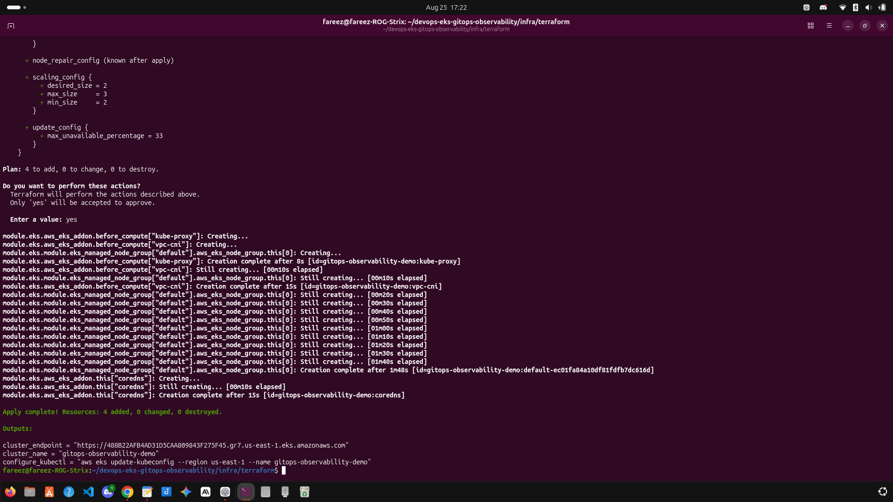
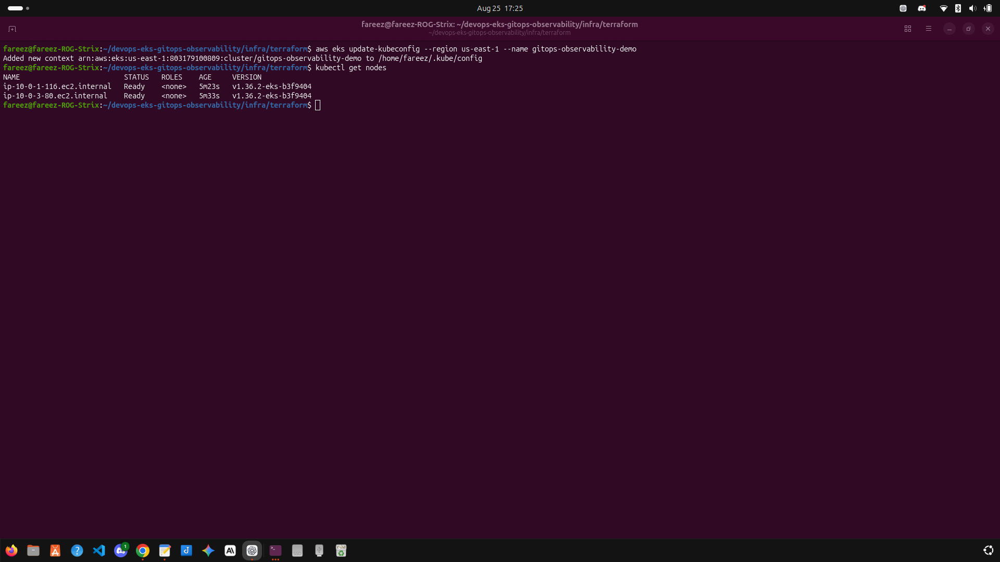
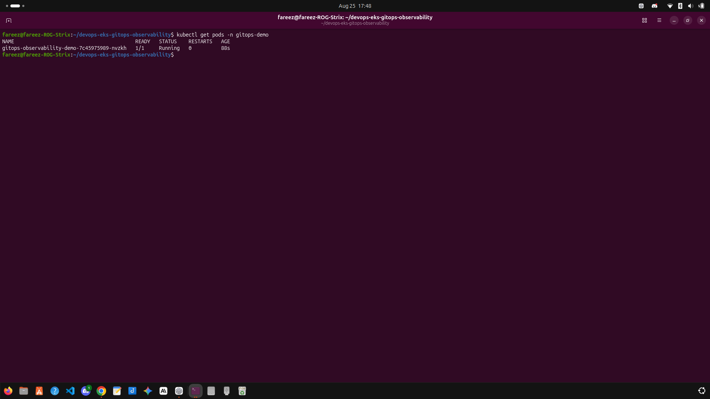
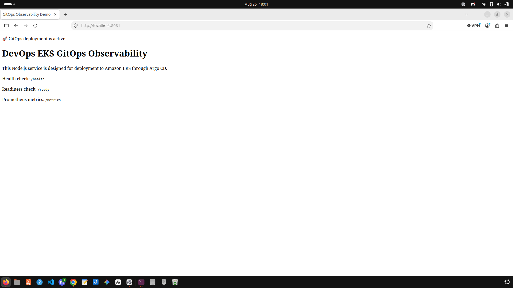
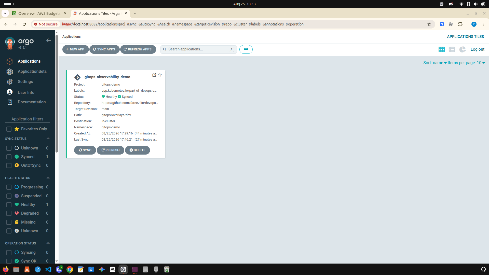
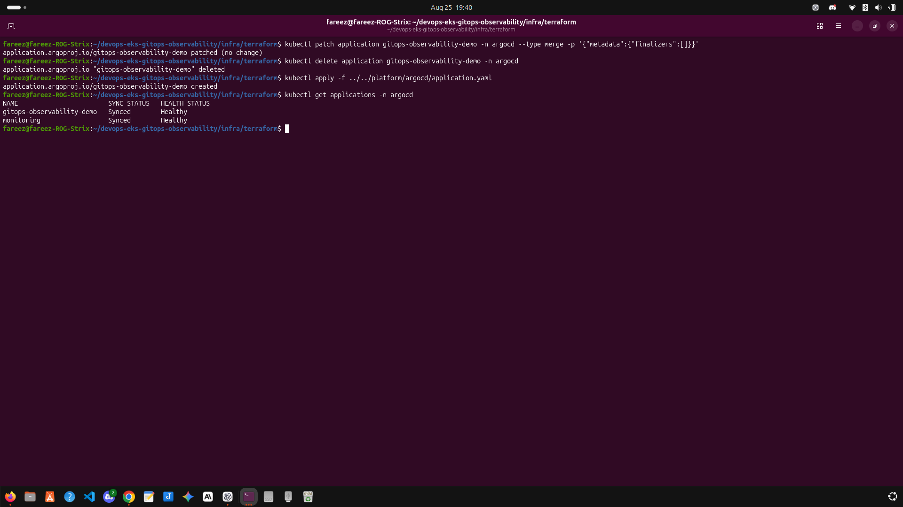
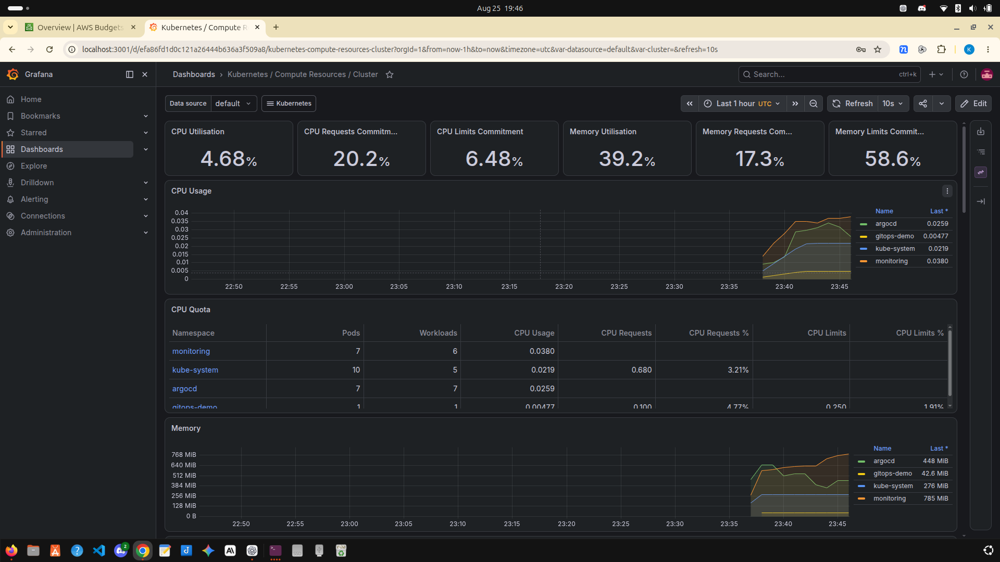
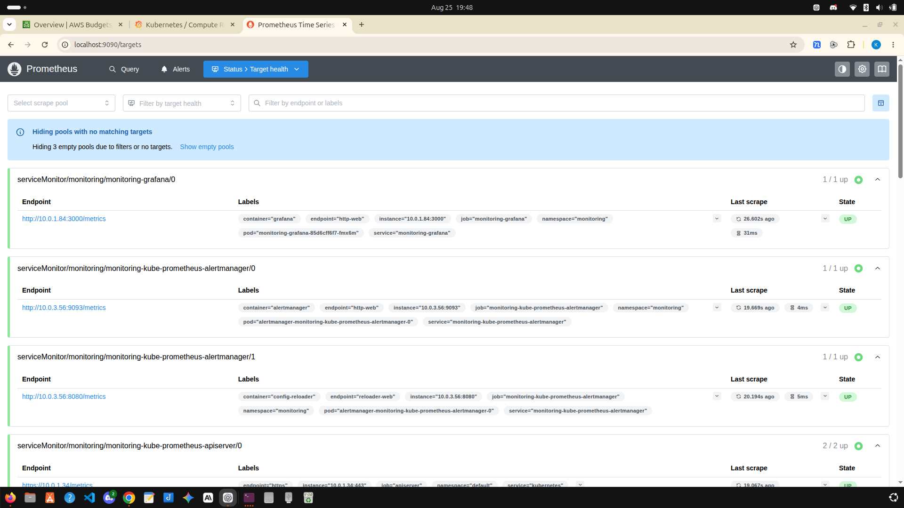
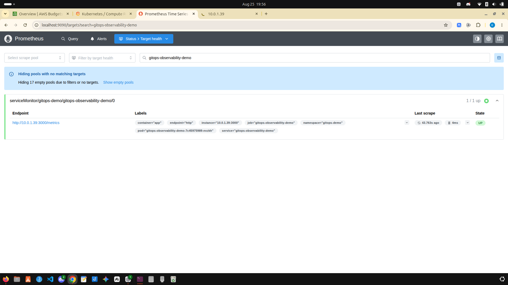

# DevOps EKS GitOps Observability

[](https://github.com/fareez-lic/devops-eks-gitops-observability/actions/workflows/ci.yml)

A DevOps portfolio project using Terraform, AWS EKS, Argo CD GitOps, Prometheus, Grafana, Docker, GitHub Actions, and a Node.js application.

## Architecture

```text
GitHub Actions → GHCR container image → Argo CD → Amazon EKS → Node.js app
                                              ↓
                                      Prometheus → Grafana

Terraform → VPC + EKS + IAM + EBS CSI driver

Verified deployment
- Terraform provisioned AWS VPC, EKS, and two worker nodes.
- GitHub Actions builds and publishes the Docker image to GHCR.
- Argo CD deploys application changes from Git.
- Prometheus scrapes the Node.js /metrics endpoint.
- Grafana displays Kubernetes cluster dashboards.

## Screenshots




















## Technology stack

- AWS EKS, VPC, IAM, EBS
- Terraform
- Docker and GitHub Container Registry
- GitHub Actions
- Kubernetes and Kustomize
- Argo CD
- Prometheus and Grafana
- Node.js, Express, prom-client

## Repository layout

```text
app/                    Node.js application
infra/terraform/        AWS infrastructure as code
gitops/                 Kubernetes manifests and Kustomize files
platform/argocd/        Argo CD configuration
platform/monitoring/    Prometheus and Grafana configuration
docs/screenshots/       Deployment evidence

Application endpoints
- /health — liveness check
- /ready — readiness check
- /metrics — Prometheus metrics
- / — demo page

## Security and reliability

- Grafana credentials are stored in a Kubernetes Secret.
- EKS API access is restricted by configurable public CIDRs.
- The application runs as a numeric non-root user.
- Kubernetes liveness/readiness probes and resource limits are configured.
- Prometheus uses persistent AWS EBS `gp3` storage.

## Troubleshooting lessons

- Fixed EKS `NodeCreationFailure` by installing VPC CNI and kube-proxy before worker nodes.
- Fixed non-root container verification by setting `runAsUser: 1000`.
- Fixed large Prometheus CRDs with Argo CD server-side apply/replace behavior.
- Added EBS CSI driver and `gp3` StorageClass for Prometheus persistence.

## Cleanup

AWS resources cost money while running. When finished:

```bash
export AWS_PROFILE=fareez-admin
cd infra/terraform
terraform destroy
This deletes AWS infrastructure only. Your GitHub repository and screenshots remain safe.
Attribution
This project was independently rebuilt and extended for learning and portfolio purposes. Its high-level learning path was inspired by the MIT-licensed GitOps-with-monitoring project by Amitabh-DevOps.
Author
Fareez Lic — @fareez-lic

